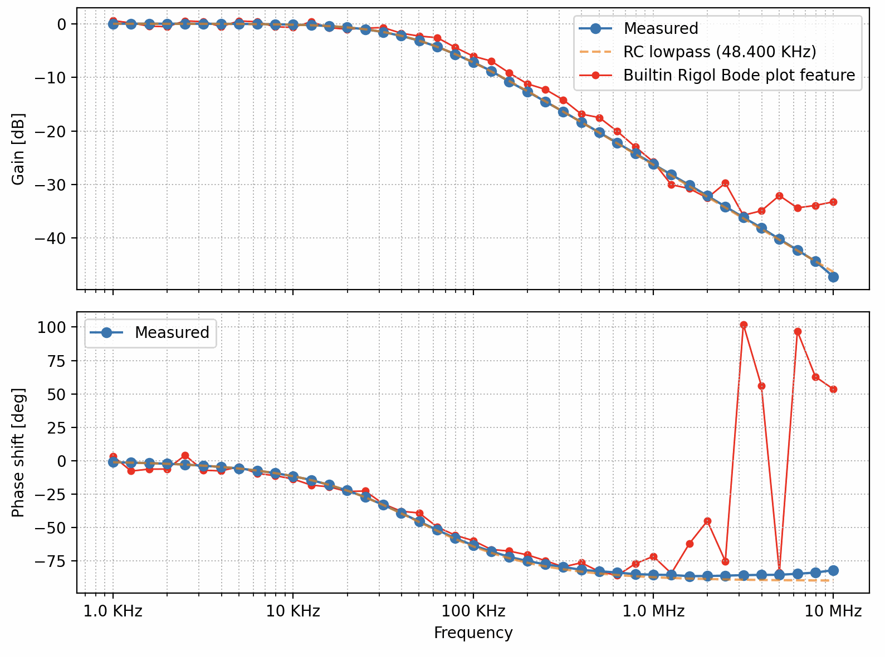
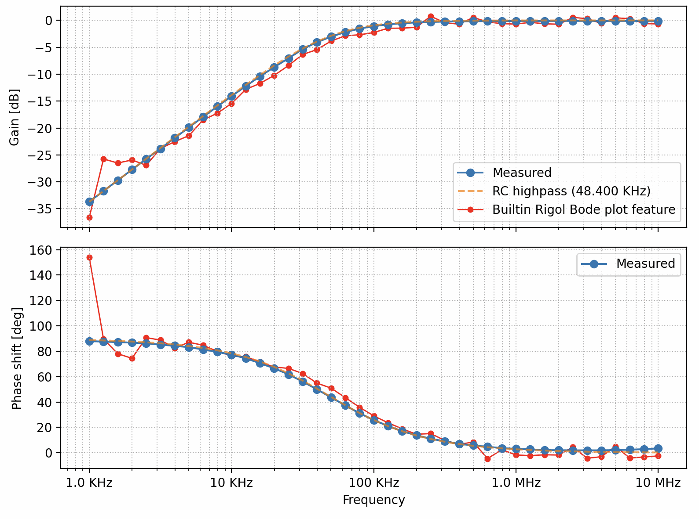
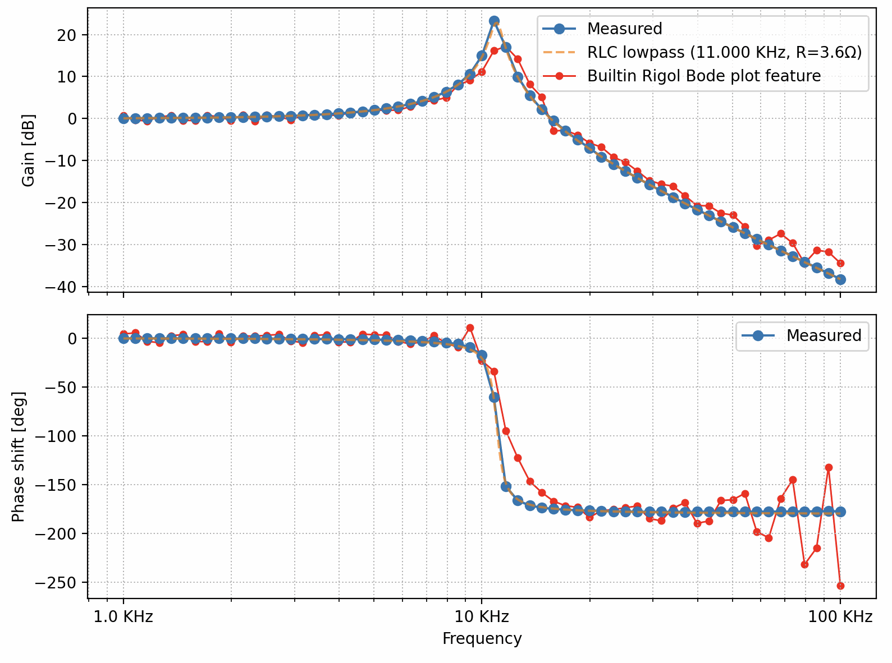

# Bode Plot Measurement Tool

Some Rigol DHO900 series oscilloscopes (DHO914S or DHO924S) provide built-in
support for generating [Bode plots](https://en.wikipedia.org/wiki/Bode_plot).
While this is very nice, the plots produced by this feature unfortunately
appear to contain artifacts and noticeably deviate from expected results. A
discussion on the EEVBlog forum mentioned that this could be a software bug and
not a hardware problem.

This simple Python package (to be run on a separate computer) can drive the
scope and arbitrary function generator via SCPI commands, using NumPy to
compute attenuation+phase shift. It provides results that better match the
expected behavior when examining simple RC/LC filters (see below for some
results).

Besides Bode plots, this package also provides ``rigol.Scope`` Pythons class
that provides a convenient abstraction over the scope's state. It implements
caching and batches updates for improved SCPI communication performance.

Note: I am a computer scientist studying electronics as a hobby. This project
was vibe-coded in an afternoon. Your mileage may vary.

## Example Measurements

<table>
  <tr>
    <td width="50%">
      
      <p align="center"><b>RC Lowpass Filter</b></p>
    </td>
    <td width="50%">
      
      <p align="center"><b>RC Highpass Filter</b></p>
    </td>
  </tr>
  <tr>
    <td width="50%">
      
      <p align="center"><b>RLC Lowpass Filter</b></p>
    </td>
    <td width="50%">
      
      <p align="center"><b>RLC Highpass Filter</b></p>
    </td>
  </tr>
</table>

## Features

- **Automated frequency sweeps** with logarithmic spacing
- **Live plotting** with real-time updates during measurement
- **Automatic dynamic range adjustment** to optimize signal quality
- **Reference curve overlays** for theoretical RC/RLC filters
- **CSV export** for post-processing and analysis
- **Headless mode** for automated measurements without GUI

## Hardware Requirements

- Rigol oscilloscope with function generator (e.g., DHO124S or DHO924S)
- Oscilloscope must be reachable via TCP/IP
- Two oscilloscope channels (default: CH1 for input, CH2 for output)

### Software Dependencies

- Python 3.7+
- `numpy` - numerical computing
- `matplotlib` - plotting
- `pyvisa` - VISA communication
- `pyvisa-py` - Python VISA backend
- `zeroconf` (optional) - for automatic scope discovery on the network

## Installation

```bash
# Clone the repository
git clone https://github.com/wjakob/bode
cd bode

# Install dependencies
pip install numpy matplotlib pyvisa pyvisa-py

# Install the package (editable mode for development)
pip install -e .
```

## Quick Start

The following are to be executed in the project directory.

### Basic measurement with live plotting

```bash
python -m rigol.bode
```

This runs a sweep from 1 KHz to 10 MHz with 5V peak amplitude and displays a
live Bode plot. The script auto-discovers the scope on the network (requires
`zeroconf` package) or uses a default IP address. It assumes 10X probes measure
the input and output at channels 1/2. See below for the full set of command
line options to change these behaviors.

### Measure and save to CSV

```bash
python -m rigol.bode --dump measurement.csv
```

### Custom frequency range and amplitude

```bash
python -m rigol.bode -a 2.5V --start 100Hz --end 1MHz --steps 50
```

### Headless mode (no GUI, shows progress)

```bash
python -m rigol.bode --headless --dump data.csv
```

## Usage Examples

### Reference Curves

Compare measurements against theoretical filter responses:

```bash
# Overlay 1st-order RC lowpass at 10 KHz cutoff
python -m rigol.bode --rc-lowpass 10KHz

# Overlay 2nd-order RLC lowpass at 100 KHz with 3.6Ω ESR
python -m rigol.bode --rlc-lowpass 100KHz:3.6

# Ideal LC filter (no resistance)
python -m rigol.bode --rlc-lowpass 100KHz

# Compare against multiple reference curves (RC and RLC)
python -m rigol.bode --rc-lowpass 1KHz --rlc-lowpass 10KHz:3.6 --rc-highpass 100Hz

# Compare ideal LC vs real RLC with resistance
python -m rigol.bode --rlc-lowpass 10KHz --rlc-lowpass 10KHz:5

# LC bandpass filter (parallel LC with voltage divider)
# Format: L:C:R_ESR:R_SOURCE
# Example: 1mH inductor, 10nF capacitor, 0.5Ω inductor ESR, 3.3kΩ protection resistor
python -m rigol.bode --lc-bandpass 1mH:10nF:0.5:3.3k

# LC bandstop (notch) filter (series LC shunt to ground)
# Example: 1mH inductor, 10nF capacitor, 0.5Ω inductor ESR, 4.7kΩ protection resistor
python -m rigol.bode --lc-bandstop 1mH:10nF:0.5:4.7k
```

### Low Amplitude Measurements

```bash
# For sensitive circuits (e.g., 10mV peak amplitude)
python -m rigol.bode -a 10mV --start 1KHz --end 100KHz
```

### 50Ω Termination

```bash
# When 50Ω terminators are physically connected to channels
python -m rigol.bode -a 5V --terminated
```

The `--terminated` flag compensates for the voltage divider effect of 50Ω terminators.

### Custom IP Address and Channels

```bash
# Use CH2 for input, CH4 for output, custom scope IP
python -m rigol.bode -i 2 -o 4 -A 192.168.1.100
```

You can also use the installed entry points `rigol` or `rigol-bode` instead of `python -m rigol.bode`.

## Command-Line Options

### Connection Options
- `-A`, `--addr` - Oscilloscope IP address (auto-discovers if not specified; specifying avoids discovery latency)
- `-i`, `--input` - Input channel 1-4 (default: `1`)
- `-o`, `--output` - Output channel 1-4 (default: `2`)

### Measurement Parameters
- `-a`, `--amplitude` - AFG signal amplitude, peak voltage (e.g., `10mV`, `5V`) (default: `5V`)
- `-s`, `--start` - Start frequency (e.g., `100Hz`, `1KHz`) (default: `1KHz`)
- `-e`, `--end` - End frequency (e.g., `100KHz`, `10MHz`) (default: `10MHz`)
- `--steps` - Number of measurement points (default: `30`)
- `--steps-per-decade N` - Number of logarithmically spaced points per decade (matches Rigol UI spacing)

### Output Options
- `-d`, `--dump` - Save data to CSV file
- `-H`, `--headless` - Run without GUI (shows progress)
- `-q`, `--quiet` - Suppress all output except errors

### Reference Curves
- `--rc-lowpass FREQ` - Overlay 1st-order RC lowpass response at cutoff frequency (can specify multiple times)
- `--rc-highpass FREQ` - Overlay 1st-order RC highpass response at cutoff frequency (can specify multiple times)
- `--rlc-lowpass FREQ[:R]` - Overlay 2nd-order RLC lowpass response at resonant frequency. Optional R specifies series resistance in Ohms for inductor ESR (e.g., `100KHz:3.6`). Can be specified multiple times
- `--rlc-highpass FREQ[:R]` - Overlay 2nd-order RLC highpass response at resonant frequency. Optional R specifies series resistance in Ohms for inductor ESR (e.g., `10KHz:3.6`). Can be specified multiple times
- `--lc-bandpass L:C:R_ESR:R_SRC` - Overlay LC bandpass (parallel LC with voltage divider). Format: `L:C:R_ESR:R_SOURCE` where L is inductance (H), C is capacitance (F), R_ESR is inductor ESR (Ω), R_SOURCE is source/protection resistor (Ω). Example: `1mH:10nF:0.5:3.3k`. Can be specified multiple times
- `--lc-bandstop L:C:R_ESR:R_SRC` - Overlay LC bandstop/notch (series LC shunt to ground). Format: `L:C:R_ESR:R_SOURCE` where L is inductance (H), C is capacitance (F), R_ESR is inductor ESR (Ω), R_SOURCE is source/protection resistor (Ω). Example: `1mH:10nF:0.5:4.7k`. Can be specified multiple times

### Advanced Options
- `--mem-depth` - Memory depth (`10K`, `100K`, `1M`, `10M`) (default: `10K`)
- `--probe-factor` - Probe attenuation factor (default: `10` for 10×)
- `--cycles` - Target cycles displayed on screen (default: `10`)
- `--headroom` - Headroom factor above signal (default: `1.2` = 20%)
- `--terminated` - Account for 50Ω termination in channel voltage computation
- `--debug {0,1,2}` - Print SCPI commands (1) or commands plus error checks (2)

## Technical Details

- **Sine wave fitting**: Uses least-squares regression to extract amplitude and
  phase at the known excitation frequency (robust to noise)

- **Dynamic voltage**: The output channel voltage scale is automatically
  adjusted during measurement: increase by 2x if signal amplitude < 25% of
  scale (improves SNR), reduction by 2x, if signal exceeds headroom threshold
  (prevents clipping).

## Using the Scope Class Directly

Beyond Bode plots, this package provides a `rigol.Scope` class for direct
oscilloscope control. It offers a property-based API with automatic command
batching for efficient SCPI communication.

### Basic Usage

```python
from rigol import Scope

# Connect to scope (auto-discovers on network if zeroconf is installed)
scope = Scope()

# Or specify IP address explicitly (avoids auto-discovery latency)
scope = Scope(ip='192.168.5.2')

# Configure timebase
scope.tdiv = '1ms'      # 1ms per division
scope.tmax = '10ms'     # Or set total time on screen (10 divisions)
scope.toffset = 0
scope.mem_depth = '10K'

# Configure channel 1
ch1 = scope.channels[0]
ch1.enabled = True
ch1.coupling = 'DC'
ch1.probe = 10          # 10x probe
ch1.vdiv = 1.0          # 1V per division
ch1.vmax = 4.0          # Or set max voltage (4 divisions from center)
ch1.offset = 0

# Configure trigger
scope.trigger.mode = 'EDGE'
scope.trigger.source = ch1  # Can use Channel object or string like 'CHAN1'
scope.trigger.level = 0.5
scope.trigger.slope = 'POSitive'

# Arm single-shot acquisition and wait
scope.single()
scope.wait_trigger(timeout=5.0)

# Read waveform data
waveform = ch1.waveform()

# Or get waveform with sample interval
waveform, dt = ch1.waveform(dt=True)
```

### Command Batching

Property changes are queued and sent to the scope in batches for efficiency.
Commands are automatically flushed before operations that need current settings
(e.g., `single()`, `run()`, property reads). You can also flush manually:

```python
scope.tdiv = '1ms'
scope.channels[0].vdiv = 0.5
scope.commit()  # Send both changes now
```

### Arbitrary Function Generator (AFG)

```python
# Configure built-in function generator
scope.afg.enabled = True
scope.afg.function = 'SINusoid'  # SINusoid, SQUare, RAMP, PULSe, DC, NOISe, ARB
scope.afg.frequency = '1kHz'
scope.afg.amplitude = '2V'       # Peak amplitude (not peak-to-peak)
scope.afg.offset = 0

# Get the voltage range (min, max) at the load
v_min, v_max = scope.afg.vrange  # (-2.0, 2.0) for 2V amplitude centered at 0

# Or set amplitude and offset by specifying the range (accepts SI strings)
scope.afg.vrange = (0, 5)        # Sets amplitude=2.5V, offset=2.5V
scope.afg.vrange = ('-500mV', '500mV')  # Sets amplitude=0.5V, offset=0V
```

#### 50Ω Termination Compensation

When using 50Ω terminators on the AFG output, the AFG's 50Ω output impedance
forms a voltage divider that halves the voltage at the load. The `termination`
property automatically compensates for this:

```python
# Set termination BEFORE setting amplitude/offset
scope.afg.termination = 50       # 50Ω load termination (also accepts '50 Ohm')
scope.afg.amplitude = '1V'       # Actual amplitude at load will be 1V
                                 # (AFG internally outputs 2V to compensate)

# For high-impedance loads (no compensation needed)
scope.afg.termination = float('inf')  # Default - no compensation
```

The compensation factor is calculated as `(R_source + R_load) / R_load` where
`R_source` is the AFG's 50Ω output impedance. For a 50Ω load, this means the
AFG outputs twice the requested voltage to achieve the desired voltage at the load.

### Adaptive Waveform Capture

The `waveform()` method supports adaptive mode that automatically adjusts
voltage scale for optimal signal quality:

```python
scope.single()
scope.wait_trigger()

# Adaptive capture: auto-adjusts vdiv if signal clips or is too small
waveform = ch1.waveform(adaptive=True, headroom=1.2)
```

### SI Unit Support

Properties accept SI unit strings for convenience:

```python
scope.tdiv = '100us'        # 100 microseconds
scope.tmax = '1ms'          # 1 millisecond
ch1.vdiv = '500mV'          # 500 millivolts
scope.afg.frequency = '10kHz'
```

### Debug Modes

```python
# Level 0: No debug output (default)
scope = Scope(debug_level=0)

# Level 1: Print SCPI commands to stderr
scope = Scope(debug_level=1)

# Level 2: Print commands and check for errors after each
scope = Scope(debug_level=2)
```

### Available Properties

**Scope:**
- `tdiv`, `tmax`, `toffset` - Timebase settings
- `tmode` - Timebase mode (`MAIN`, `XY`, `ROLL`)
- `mem_depth` - Memory depth (`1K`, `10K`, `100K`, `1M`, `10M`, `25M`, `50M`)
- `acq_type` - Acquisition type (`NORMal`, `PEAK`, `AVERages`, `ULTRa`)
- `acq_averages` - Number of averages

**Channel:**
- `enabled` - Channel display on/off
- `vdiv`, `vmax` - Voltage scale
- `offset`, `position` - Vertical offset and position
- `coupling` - Input coupling (`DC`, `AC`, `GND`)
- `probe` - Probe attenuation factor
- `bwlimit` - Bandwidth limit (`20M`, `OFF`)
- `invert` - Invert display

**Trigger:**
- `mode` - Trigger mode
- `source` - Trigger source (Channel object or string)
- `level` - Trigger level voltage
- `slope` - Trigger slope
- `sweep` - Trigger sweep mode
- `nreject` - Noise rejection

**AFG:**
- `enabled` - Output on/off
- `function` - Waveform type
- `frequency` - Output frequency
- `termination` - Load termination resistance (e.g., 50) for voltage compensation
- `amplitude` - Output amplitude, peak voltage (compensated for termination)
- `offset` - DC offset (compensated for termination)
- `vrange` - Output voltage range (min, max) derived from amplitude and offset
- `phase` - Phase offset
- `duty` - Square wave duty cycle
- `symmetry` - Ramp symmetry

## License

This project is licensed under the BSD 3-Clause License.
